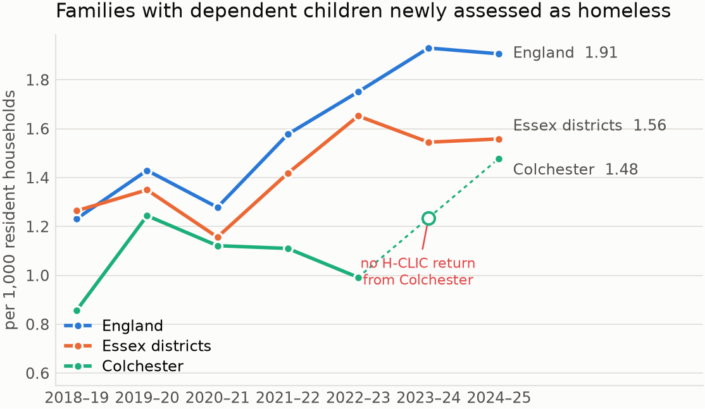
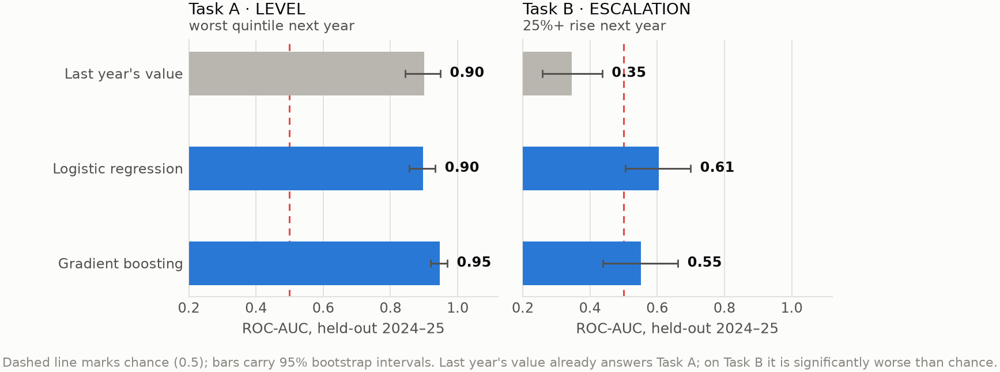

# Predicting rises in family homelessness

[](LICENSE)
[](https://www.nationalarchives.gov.uk/doc/open-government-licence/version/3/)
[](https://www.python.org/)

Which English local authorities are about to see more families with children
become homeless, and can that be known a year in advance? This repository
answers the question on published data, with a validation design strict enough
that the answer is worth acting on.

Everything runs on public statistics released under the Open Government
Licence. No personal or household-level data was used at any point.

### [Open the dashboard →](https://mahdisabetkish.github.io/family-homelessness-early-warning/)

| Page | What is on it |
|---|---|
| [Overview](https://mahdisabetkish.github.io/family-homelessness-early-warning/#overview) | The trend, and the two tasks side by side |
| [Capacity planner](https://mahdisabetkish.github.io/family-homelessness-early-warning/#capacity) | Set your team's caseload and read the hit rate off directly |
| [National ranking](https://mahdisabetkish.github.io/family-homelessness-early-warning/#ranking) | Every authority scored, searchable and sortable, against what happened |
| [Colchester](https://mahdisabetkish.github.io/family-homelessness-early-warning/#colchester) | 105 neighbourhoods, segmented and anomaly-screened |
| [Dataset](https://mahdisabetkish.github.io/family-homelessness-early-warning/#dataset) | Sample counts, feature groups, missingness, class balance |
| [Models & results](https://mahdisabetkish.github.io/family-homelessness-early-warning/#models) | Every model, its configuration, and what it scored |
| [Method & limits](https://mahdisabetkish.github.io/family-homelessness-early-warning/#method) | Validation protocol, boundary reconciliation, what this is not |

<p align="center">
  
</p>

## What the analysis found

Two questions were put to the same data. The first turns out to be a lookup;
the second is the one worth modelling. Reporting both is deliberate.

| | Question | Best baseline | Best model | Hit rate in a list of 30 |
|---|---|---|---|---|
| **Task A** | Will this authority be in the worst national quintile next year? | **0.90** (last year's value) | 0.95 | 97% |
| **Task B** | Will family homelessness rise by 25% or more next year? | **0.35** (last year's change) | 0.61 | 30% against a 15% base rate |

Scores are ROC-AUC on 2024-25, a year no model saw during fitting. Four
predictive models were fitted for each task (penalised logistic regression,
gradient boosting, the same calibrated, and a Monte-Carlo dropout neural
network in PyTorch) alongside two reference baselines. See
[MODELS.md](MODELS.md) for what each one is for and what it scored.

Three things came out of this that would change how I approached the real
project.

**The obvious heuristic is worse than useless.** Ranking authorities by last
year's increase scores 0.35 [0.26-0.44] on the escalation task, significantly
*below* chance. Rises mean-revert, so a service acting on "it went up last year"
is systematically sending help to the places least likely to need it next. That
is a finding about the data, not about the model, and it holds regardless of
what you fit afterwards.

**Ranking the whole country is not the useful output.** A housing team works a
list of fixed length, so what matters is the hit rate at the top of that list.
At thirty authorities the model finds escalation in 30% of them against a 15%
base rate, roughly twice the yield for the same effort. The
[capacity planner](https://mahdisabetkish.github.io/family-homelessness-early-warning/#capacity)
in the dashboard lets you set the list length and read the number off directly.

**Risk and deprivation are not the same thing.** At neighbourhood level in
Colchester, an Isolation Forest flags eleven of the 105 LSOAs as unusual. Five
of them sit in the less deprived half of England and between them contain
1,337 children aged 0-15. Any triage that sorts on headline deprivation will
step straight past those neighbourhoods.

<p align="center">
  
</p>

## Something the pipeline caught

Colchester filed no H-CLIC return in 2023-24, one of eighteen authorities
missing that year. Summing the missing values to zero, which is what
`groupby().sum()` does by default, produces a chart showing family homelessness
in Colchester collapsing to nothing and then recovering. It never happened.

The trend chart above breaks the line rather than bridging it, and the pipeline
prints the count of missing returns per year. Non-reporting is treated as a
result in its own right, because a silent zero and a genuine success look
identical once they are in a summary table.

## How it works

| Stage | Script | What it does |
|---|---|---|
| 00 | `00_download.py` | Fetch the source files from gov.uk, checksum each one |
| 01 | `01_extract_hclic.py` | Parse seven publication spreadsheets into tidy per-year tables |
| 02 | `02_build_panel.py` | Select measures, reconcile boundary changes, convert counts to rates |
| 03 | `03_colchester_lsoa.py` | Segment and anomaly-screen Colchester's neighbourhoods |
| 04 | `04_model.py` | Prospective backtest of both tasks, with bootstrap intervals |
| 05 | `05_figures.py` | Every figure in the slides and the README |
| 06 | `06_facts.py` | Every number in the slides, written out as LaTeX macros |
| 07 | `07_dashboard_data.py` | The JSON the dashboard reads |
| 08 | `08_data_profile.py` | The dataset card, measured from the built artefacts |

Most stages are under a hundred lines of wiring; what they run lives in
`fhew`, described under [Layout](#layout). Stages 05 and 07 are longer, because
composing seven charts and nine JSON payloads is work with exactly one consumer
each and nothing to share.

Three parts of this were more work than they look.

**The source files are publications, not data.** Each `.ods` release carries
two to six stacked header rows with merged cells, footnote markers glued onto
labels, region subtotals interleaved with local authorities, and sheet names
that change between releases. `fhew.hclic` handles that: it drops banner
rows, forward-fills merged headers, collapses them into one label per column,
and separates each published count from the percentage twin that shares its
header.

**Measures are selected by header text, never by column position.** MHCLG
reworded and added measures over the seven years. Every measure carries a list
of alternative header patterns, and the coverage of each measure in each year
is printed. 251 of 252 measure-years resolve; the single gap is real, because
Section 21 notices were not collected in 2018-19. If a future release moves a
column, the pipeline raises rather than quietly reading the wrong one.

**Local authorities move.** There were 326 districts in 2018-19 and 296 in
2024-25, while the deprivation indices are published on 2019 boundaries. Seven
successor authorities have their deprivation scores rebuilt by
population-weighting their predecessors' LSOAs, and fourteen districts
abolished in April 2019 inherit their successor's score. Every authority-year
in the panel ends up with a deprivation score, and the reconciliation is
printed rather than hidden.

## Validation

The design is strictly temporal. Models are fitted on outcome years up to
2023-24 and scored once on 2024-25. Nothing is tuned on the test year.

Every threshold is fixed from the training years alone. The "worst quintile"
cutoff, for instance, is a quantile of the training outcomes, not of the year
being scored, so no information from the scored year reaches its own label
definition. The escalation label needs no cross-sectional information at all,
since it is a within-authority relative change.

All ranking metrics carry 95% bootstrap intervals. With around 270 authorities
and a small positive class, differences of a few points between models sit
inside sampling noise, and the intervals say so. Probabilities are isotonically
calibrated: whoever acts on a triage score will read it as a probability, so it
had better be one.

## Data

| Source | What it provides |
|---|---|
| [MHCLG statutory homelessness (H-CLIC), detailed local authority tables](https://www.gov.uk/government/statistical-data-sets/live-tables-on-homelessness) | Households owed prevention and relief duties by household composition, reason for loss of home, support needs and prior accommodation, financial years 2018-19 to 2024-25 |
| [English Indices of Deprivation 2019](https://www.gov.uk/government/statistics/english-indices-of-deprivation-2019) | Deprivation domain scores at local authority and LSOA level, including IDACI and population denominators |

The outcome modelled throughout is families with dependent children newly owed
a *relief* duty, meaning already homeless rather than threatened with
homelessness, expressed per 1,000 resident households. Raw counts would make
the model a population-size detector.

See [DATASET.md](DATASET.md) for sample counts, feature groups, missingness
and the class balance, and [DATA_DICTIONARY.md](DATA_DICTIONARY.md) for the
definition of every field.

## Running it

```bash
git clone https://github.com/mahdisabetkish/family-homelessness-early-warning.git
cd family-homelessness-early-warning

make setup     # virtualenv, dependencies, and the package itself
make all       # download, build, model, figures, slides, dashboard
make serve     # preview the dashboard at http://localhost:8000
```

`make setup` installs the project editable, so `import fhew` works from the
stage scripts, the tests and a notebook without anything touching `sys.path`.
Dependencies are declared once, in `pyproject.toml`.

Individual stages work too (`make panel`, `make model`, `make figures`). The
first run downloads about 30 MB from gov.uk and spends a couple of minutes
parsing the spreadsheets; results are cached, so later runs are quick.

The network runs on CPU. `torch` pulls CUDA wheels by default, which are far
larger than anything this needs:

```bash
pip install torch --index-url https://download.pytorch.org/whl/cpu
```

`make test` runs the suite: 82 cases across 78 test functions, covering the
spreadsheet parser, measure selection, the boundary maps, the leak-free
construction of the design matrix, the metrics and the model registry. 68 of
them run on a fresh clone with nothing built; the remaining 14 check
properties of the real artefacts and skip until `make all` has been run.

Building the slides needs a TeX installation with `beamer` and the `metropolis`
theme. On Debian or Ubuntu, `texlive-latex-extra` and
`texlive-fonts-extra` are enough.

## Layout

The code is in two halves. `fhew` is an installed package holding the logic:
parsing, measure selection, boundary reconciliation, feature construction, the
models and their evaluation. The numbered scripts are thin stage runners that
read one artefact, call into the package, print what happened and write the
next artefact.

The split is what makes the analysis testable. Every function where a bug
would quietly change a published number is importable and has tests against
inputs whose answers are known by hand, rather than being reachable only by
running the whole pipeline and looking at whether the output seems plausible.

```
├── src/
│   ├── fhew/                 the analysis package
│   │   ├── config.py         every path, year and threshold, defined once
│   │   ├── sources.py        where the raw files come from
│   │   ├── hclic.py          the publication-spreadsheet parser
│   │   ├── panel.py          measure selection, boundary maps, rate conversion
│   │   ├── features.py       design matrix and the two task labels
│   │   ├── models.py         the model zoo and what each member is for
│   │   ├── mlp.py            the MC-dropout network
│   │   ├── evaluation.py     the prospective backtest, metrics, bootstrap
│   │   ├── neighbourhoods.py segmentation and anomaly detection
│   │   ├── plotting.py       design tokens and figure plumbing
│   │   ├── profiling.py      the dataset card, measured from the artefacts
│   │   └── export.py         JSON for the dashboard, macros for the slides
│   └── 0*.py                 the nine pipeline stages, in order
├── tests/                    pytest suite
├── docs/                     the dashboard, served by GitHub Pages
├── slides/                   beamer presentation and its generated facts.tex
├── outputs/
│   ├── figures/              every chart, as PDF and PNG
│   ├── tables/               performance and per-authority predictions
│   └── models/               run summary and introspected specifications
└── data/                     raw, interim and processed (all gitignored, all rebuilt)
```

Two consequences worth naming. Constants live in one place, so the split years
cannot mean one thing in the model stage and another in the dataset card.
And the model specifications the dashboard prints are introspected from the
fitted pipelines rather than typed, so a hyperparameter cannot change without
the published description changing with it.

## What this is not

The published statistics are aggregate, so this predicts *areas* rather than
households. It is a test of method and of my own reasoning about the problem,
not a finding about any individual family in Colchester.

Deprivation is fixed at 2019 while outcomes run to 2025. Non-reporting is
almost certainly not random, and I have not attempted to model it. The effect
sizes on the escalation task are modest and the intervals are wide.

The same design applied to household-level records would be a different
proposition. Monthly rent account trajectories, repairs, anti-social behaviour
reports, contact history and tenancy events are leading indicators; H-CLIC
records only the outcome, and only once a year. That is where the horizon
shortens from a year to a few weeks, which is the range in which prevention
actually works.

## Documentation

| File | What it covers |
|---|---|
| [DATASET.md](DATASET.md) | Sample counts, feature groups, missingness, class balance, the split. Generated from the built data |
| [MODELS.md](MODELS.md) | All eight models, their configuration, and why each one is there |
| [DATA_DICTIONARY.md](DATA_DICTIONARY.md) | Definition of every field in the panel and the design matrix |

## Licence

Code is MIT. The underlying statistics are Crown copyright, released under the
Open Government Licence v3.0.

> Contains public sector information licensed under the Open Government Licence
> v3.0.
